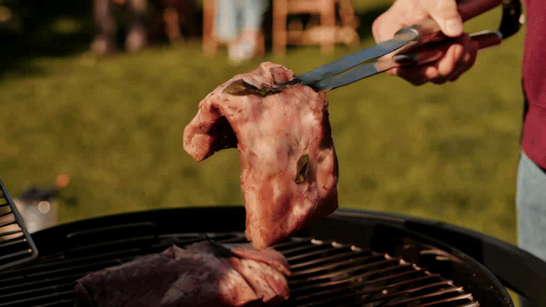
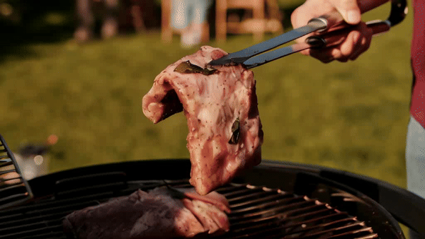
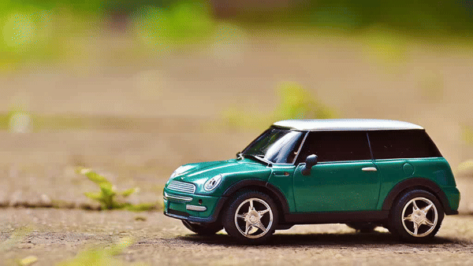

## Comparison: SVD vs. SVD + VCUT

<table>
  <tr>
    <td></td>
    <td></td>
  </tr>
</table>

**In this sample, the teapot generated by SVD is deformed, while VCUT preserves its shape.**

---

<table>
  <tr>
    <td></td>
    <td></td>
  </tr>
</table>

**Here, the car motion is jittery in SVD, while VCUT smooths it out.**

---

<table>
  <tr>
    <td></td>
    <td></td>
  </tr>
</table>

**SVD fails to maintain consistent background, but VCUT fixes this issue.**

---

<table>
  <tr>
    <td></td>
    <td></td>
  </tr>
</table>

**Face details are unstable in SVD, but much clearer with VCUT.**

---

<table>
  <tr>
    <td></td>
    <td></td>
  </tr>
</table>

**The flower’s structure collapses in SVD, while VCUT retains coherence.**

---

<table>
  <tr>
    <td></td>
    <td></td>
  </tr>
</table>

**Dog motion becomes blurry in SVD, but VCUT keeps it consistent.**
